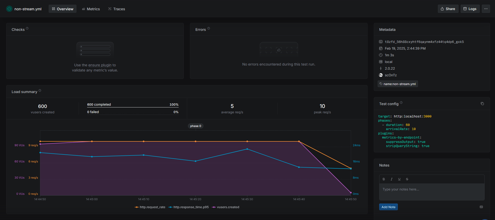
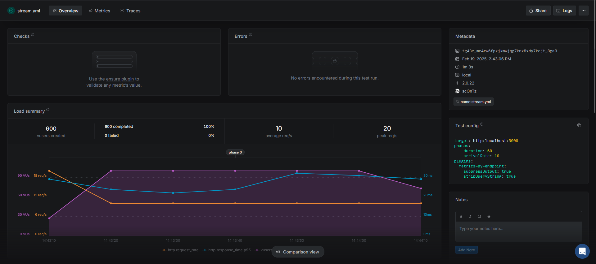

For poc server set full file or stream is better\

Server Prepare\
limit maximum memory\
`node --max-old-space-size=32 server1.js` \
`node --max-old-space-size=32 server2.js`

non-limit maximum memory\
`node --max-old-space-size=32 server1.js`\
`node --max-old-space-size=32 server2.js`

Gen large-file\
`fsutil file createnew large-file.txt 10485760`

Artillery Load Test Scripts

Install Artillery

First, make sure you have Node.js installed. Then, install Artillery globally:

`npm install -g artillery`

`artillery run load-test/non-stream.yml --record --key key from app.artillery.io`\
`artillery run load-test/stream.yml --record --key from app.artillery.io`\
\
\
my result at limit memory for node\
\
non-stream\

stream\

my result at non-limit memory for node
